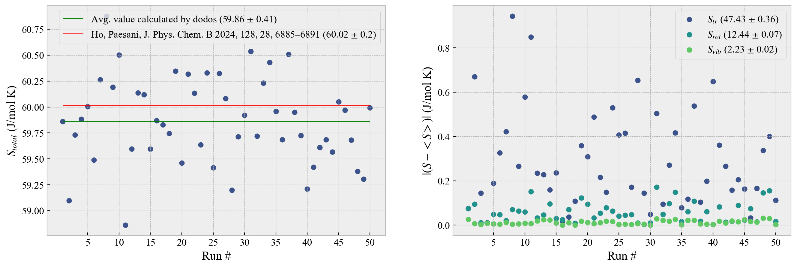

## Installation

Download the *zip* archive from the **Releases** section, extract it, go into the extracted directory and run the following in a terminal:

```bash
pip install -r requirements.txt
pip install .
```

## Quick start

Make sure GROMACS is accessible, and the name of the executable is 'gmx'. If not, change 'gmx' into whatever your own executable name is.
Head into example/TIP4P2005F, and run the following:

```bash
gmx mdrun -v -s example.tpr
chmod +x dump-from-trajectory.sh
./dump-from-trajectory.sh
cd dodos
dodos -T 298 -t $(nproc)
```

This will run an example NVT simulation of 1000 molecules of TIP4P/2005F water in GROMACS, then use GROMACS in-built tools to dump the trajectories into a format accessible by this script. After that, dodos will run, utilizing all processors available on your system to parallelize the procedure. Once it's done, it will print out the entropy data in your console window, and create a txt file with the calculated DOS, and make some plots for your viewing. The console output should be something similar to the following:


The molar entropy of TIP4P/2005F water at 298K is ~60 (J/mol K) [4]. Add up the translational, rotational and vibrational entropy printed in your console output and if it's about 60, then you're done.

PS: The trajectory files (.trr) and the dump files (.xvg) will be considerable in size, around a gigabyte each. To clean up the old data, you can launch the other pre-written script 'clean-example-files.sh' which will delete the existing data and free up space.

## Usage

The starting point for every dodos run is the trajectory file (.trr) output by your Gromacs simulation (traj.trr). Note that compressed output (.xtc) cannot be used as they don't store velocities, that are necessary for this script to run.

1. To make sure that the molecules in the trajectory files aren't broken due to PBC, use *gmx trjconv* to make molecules whole.

```bash
 gmx trjconv -f traj.trr -s <mysimulation.tpr> -o traj_whole.trr -pbc whole
```

(Choose the 'System" option, or whatever option you desire to perform this calculation for.)

2. Now use *gmx traj* to dump the coordinates and velocities from the *trr* trajectory file into *xvg* dump files that can be read by the Python script. **Note that the option *-n* passes an *ndx* file containing atom indices for OW, HW1 and HW2 atoms**, which are the atoms in 4-point water models such as TIP4P/2005F. The virtual sites (usually named MW) in 4-point water models are massless and do not contribute to the DoS, hence need not be included in the dump. This will reduce the dump file size, as well as the number of computations required.

```bash
 gmx traj -f traj_whole.trr -n not_name_OW.ndx -s <mysimulation.tpr> -ov veloc.xvg -ox pos.xvg -ob box.xvg
```

3. In the directory where you'd like to run **dodos**, create the atomic mass file (masses.txt) containing the atomic masses of all the atomics in your molecule *in the same order as they appear in your system*. For example, in this example TIP4P/2005F system, the atoms appear in the order *O,H,H* with masses 15.999, 1.001, 1.001 respectively. Hence, the *masses.txt* should look something like this:

```
15.999
1.001
1.001
```

4. Now that all the necessarily files have been prepared, it is time to launch **dodos**. To check a list of command line options, run:

```bash
 dodos --help
```

If you are already inside the same directory as all the required files, run:

```bash
 dodos --temperature 298 --threads $(nproc)
```

The option *--threads* tells it how many jobs it should spawn to utilize the parallelization option. *--temperature* provides the user-input system temperature to be taken in consideration during the analysis.

5. After **dodos** has finished running, you can view the image plots for the DOS calculation, raw DOS data (DoS.txt), as well as the resulting entropy in the output file *entropy.txt*. A log.txt file is also written.

## Validation and Error

To compare the validity and error of **dodos**, a dataset of 10 runs was generated, with the same initial conditions provided from the *example.tpr* file. For each run, **dodos** was launched to analyze the corresponding trajectory, and hence calculate the entropy. These were tallied, graphed and compared with the literature value [4] as shown:



**dodos** achieves agreement within one std. deviation with [4], although it's standard error (0.41 J/molK) is not quite as good. When compared to itself, as shown on the right hand side, the script achieves a standard error of 0.36, 0.07, 0.02 J/molK on the translational, rotational and vibrational components of the entropy.

## Thread scaling

**dodos** can utilize parallelization using the *concurrent.futures* library in the standard Python library. The *--threads* option when calling **dodos** from the command line will allow it to utilize as many sub-processes to parallelize the velocity decomposition. To investigate the scaling of this process with the value of the *--threads* option, **dodos** was run once each by passing values from 1 to 32 to the *--threads* options.


## Changelog

- **1.30**

  - Changed the root finder method in the fluidicity calculation from `secant` to `brentq`.
  - The `secant` method sometimes caused bugs that resulted in a negative hard-sphere entropy.
  - Switching to `brentq` with appropriate solution range resolves the issue in previously reproducible cases.
  - Modified the extrapolation of the zero-frequency rotational DoS to a cubic polynomial (previously linear).
  - Now report hard sphere parameters y and z in the log file.
  - Modified the TIP4P/2005F example to neglect dumping info for the *MW* virtual site, as it does not contribute to the DoS. This reduces redundant computations and saves disk spaces.
- **1.22**

  - Added a user-defined volume option to override the simulation volume when a dump is not used.
- **1.21**

  - Added basic Python packaging support.
  - You can now install the package using `pip install .` in the main folder containing *setup.py*.
- **1.20**

  - Replaced `sys.argv` with the `argparse` module for argument parsing.
- **1.00**

  - First release.

## References

[1] Shiang-Tai Lin, Mario Blanco, William A. Goddard; The two-phase model for calculating thermodynamic properties of liquids from molecular dynamics: Validation for the phase diagram of Lennard-Jones fluids. J. Chem. Phys. 8 December 2003; 119 (22): 11792–11805. https://doi.org/10.1063/1.1624057

[2] Lin ST, Maiti PK, Goddard WA 3rd. Two-phase thermodynamic model for efficient and accurate absolute entropy of water from molecular dynamics simulations. J Phys Chem B. 2010 Jun 24;114(24):8191-8. doi: 10.1021/jp103120q. PMID: 20504009

[3] Huang, S W, Tod A. Pascal, William A. Goddard, Prabal Kumar Maiti and Shiang‐Tai Lin. “Absolute Entropy and Energy of Carbon Dioxide Using the Two-Phase Thermodynamic Model.” Journal of chemical theory and computation 7 6 (2011): 1893-901

[4] Ching-Hwa Ho and Francesco Paesani. Entropy of Liquid Water as Predicted by the Two-Phase Thermodynamic Model and Data-Driven Many-Body Potentials". The Journal of Physical Chemistry B 2024 128 (28), 6885-6891 DOI: 10.1021/acs.jpcb.4c03245
