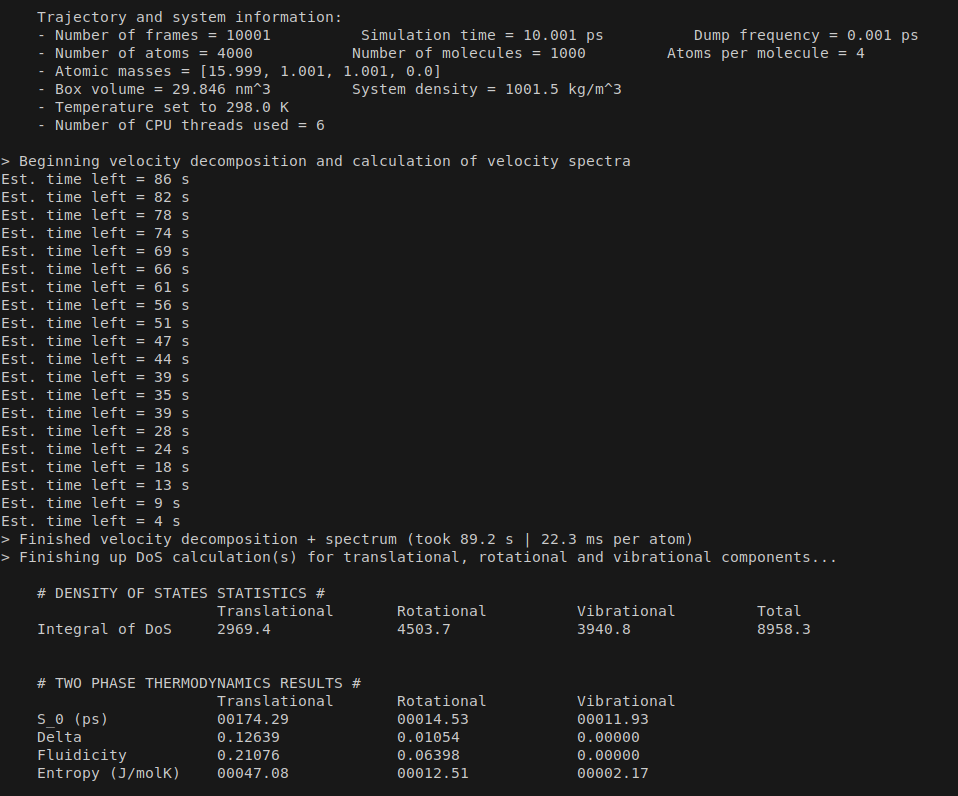

Uses Numpy, Scipy and Matplotlib.

## Installation

Clone or download the repository, go into directory and:

```bash
pip install -r requirements.txt
pip install .
```

## Quick start

Make sure GROMACS is accessible, and the name of the executable is 'gmx'. If not, change 'gmx' into whatever your own executable name is.
Head into example/TIP4P2005F, and run the following:
```bash
gmx mdrun -v -s example.tpr
chmod +x dump-from-trajectory.sh
./dump-from-trajectory.sh
cd dodos
dodos -T 298 -t $(nproc)
```
This will run an example NVT simulation of 1000 molecules of TIP4P/2005F water in GROMACS, then use GROMACS in-built tools to dump the trajectories into a format accessible by this script. After that, dodos will run, utilizing all processors available on your system to parallelize the procedure. Once it's done, it will print out the entropy data in your console window, and create a txt file with the calculated DOS, and make some plots for your viewing. The console output should be something similar to the following:



The molar entropy of TIP4P/2005F water at 298K is ~60 (J/mol K) [4]. Add up the translational, rotational and vibrational entropy printed in your console output and if it's about 60, then you're done.

PS: The trajectory files (.trr) and the dump files (.xvg) will be considerable in size, around a gigabyte each. To clean up the old data, you can launch the other pre-written script 'clean-example-files.sh' which will delete the existing data and free up space. 

## Changelog
- 1.22

1. Added user-defined volume option to override the option of using a dump for the box size.

- 1.21

1. Very barebones python packaging implemented.
2. Install using "pip install ."

- 1.20

1. No longer using sys.argv to parse arguments.
2. argparse used instead.

- 1.00

1. First release.


## References

[1] Shiang-Tai Lin, Mario Blanco, William A. Goddard; The two-phase model for calculating thermodynamic properties of liquids from molecular dynamics: Validation for the phase diagram of Lennard-Jones fluids. J. Chem. Phys. 8 December 2003; 119 (22): 11792–11805. https://doi.org/10.1063/1.1624057

[2] Lin ST, Maiti PK, Goddard WA 3rd. Two-phase thermodynamic model for efficient and accurate absolute entropy of water from molecular dynamics simulations. J Phys Chem B. 2010 Jun 24;114(24):8191-8. doi: 10.1021/jp103120q. PMID: 20504009

[3] Huang, S W, Tod A. Pascal, William A. Goddard, Prabal Kumar Maiti and Shiang‐Tai Lin. “Absolute Entropy and Energy of Carbon Dioxide Using the Two-Phase Thermodynamic Model.” Journal of chemical theory and computation 7 6 (2011): 1893-901

[4] Ching-Hwa Ho and Francesco Paesani. Entropy of Liquid Water as Predicted by the Two-Phase Thermodynamic Model and Data-Driven Many-Body Potentials". The Journal of Physical Chemistry B 2024 128 (28), 6885-6891 DOI: 10.1021/acs.jpcb.4c03245 
